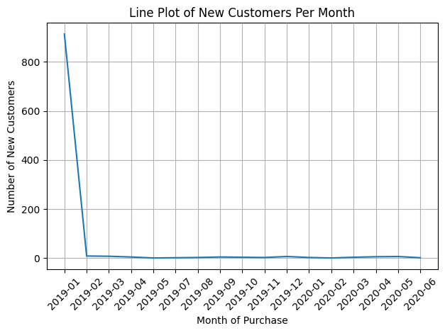
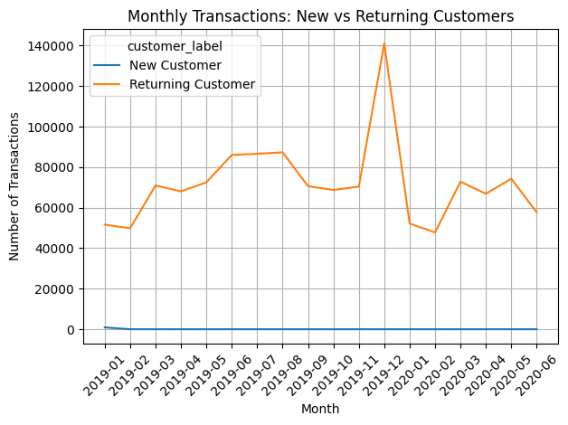
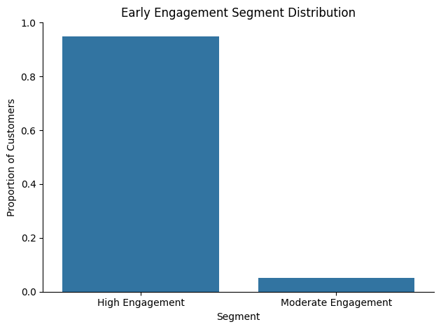

# **Customer Journey and Lifecycle Analysis**

## **Project Overview**

In this project, I analyzed transaction level credit card data to understand how customers enter the business and how their behavior evolves early in their lifecycle.
Rather than focusing on isolated transactions, I reframed the dataset around the customer journey, emphasizing entry timing, early engagement intensity, and behavioral trajectories.

The analysis is split into two notebooks, each answering a different stage of the customer lifecycle.

## **Key Questions**

Throughout this project, I focused on answering the following questions:

- When do customers first appear?

- How does customer acquisition change over time?

- How many customers are new vs returning?

- What does early customer behavior look like?

- How does early engagement intensity shape customer trajectories?

## **Dataset**

I used the Credit Card Transactions Dataset from Kaggle (priyamchoksi/credit-card-transactions-dataset).
This is the same dataset I used in my Consumer Behavior — Spending Analysis project, but here I approached it from a lifecycle and engagement perspective.

Definitions used in this project:

- A customer is identified by a unique cc_num

- An event is a transaction

- Time is defined by the transaction timestamp


## **Notebook 1: Customer Lifecycle Entry Analysis**

**Objective**

The goal of this notebook was to understand how and when customers enter the business, and whether customer acquisition is flat, growing, or perhaps volatile over time.

### **Core Analysis Steps**

First, I identified each customer’s first transaction date, which I treated as the moment they entered the business.
``` python

first_purchase = (
    df.groupby("cc_num")["trans_date_trans_time"]
      .min()
      .reset_index(name="first_purchase_date")
)

```

I then classified every transaction as either a New Customer or Returning Customer transaction by comparing the transaction date to the first purchase date.

``` python

def customer_label(row):
    if row["trans_date_trans_time"] == row["first_purchase_date"]:
        return "New Customer"
    else:
        return "Returning Customer"

df["customer_label"] = df.apply(customer_label, axis=1)
```

## **Customer Acquisition Over Time**



This visualization shows how many new customers entered the business each month and highlights how concentrated customer acquisition is over time.

## **Monthly Transactions: New vs Returning Customers**



This comparison shows that overall transaction activity is primarily driven by returning customers, while new customers serve as entry points into the lifecycle.

Early Behavior (First 30 Days)

To understand what customers do immediately after their first purchase, I analyzed activity within the first 30 days.

``` python
early_metrics = (
    df_30d.groupby("cc_num")
          .agg(
              txn_30d=("amt", "count"),
              spend_30d=("amt", "sum")
          )
          .reset_index()
)
```

This provided a baseline for early engagement and allows deeper analysis in Notebook 2.

##  **Notebook 2: Early Engagement Intensity and Customer Trajectories**

**Objective**

In this notebook, I focused on how early engagement intensity shapes customer behavior during the first 30 days after entry.

**Engagement Segmentation**

I segmented customers based on the number of transactions they made in their first 30 days:

- Low Engagement: 1–2 transactions

- Moderate Engagement: 3–10 transactions

- High Engagement: 11+ transactions

```python
def engagement_segment(txn_count):
    if txn_count <= 2:
        return "Low Engagement"
    elif txn_count <= 10:
        return "Moderate Engagement"
    else:
        return "High Engagement"

```
## **Early Engagement Segment Distribution**



This chart shows how customers distribute across engagement levels early in their lifecycle.

## **Early Engagement Trajectories (First 30 Days)**


This is the core visualization of the project.

``` python
trajectory = (
    daily_txns.groupby(["engagement_segment", "days_since_first_purchase"])
              .agg(avg_cumulative_txns=("cumulative_txns", "mean"))
              .reset_index()
)
```

From this chart, I observed that:

- High engagement customers show consistent, sustained transaction growth

- Moderate engagement customers transact early but quickly fall off

- Shorter trajectory lines indicate behavioral inactivity, not missing data

## **Key Insights**

Customer acquisition is heavily front loaded in the dataset

Most transaction volume comes from returning customers

Early engagement intensity strongly predicts short term behavioral momentum

Customers who engage heavily in their first few days tend to remain active, while moderate engagement customers disengage quickly